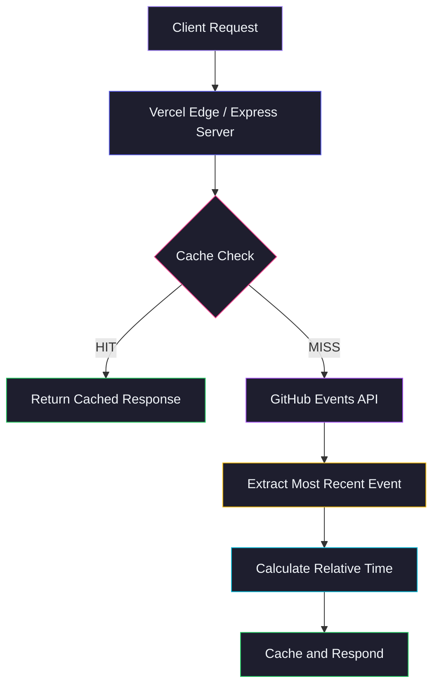
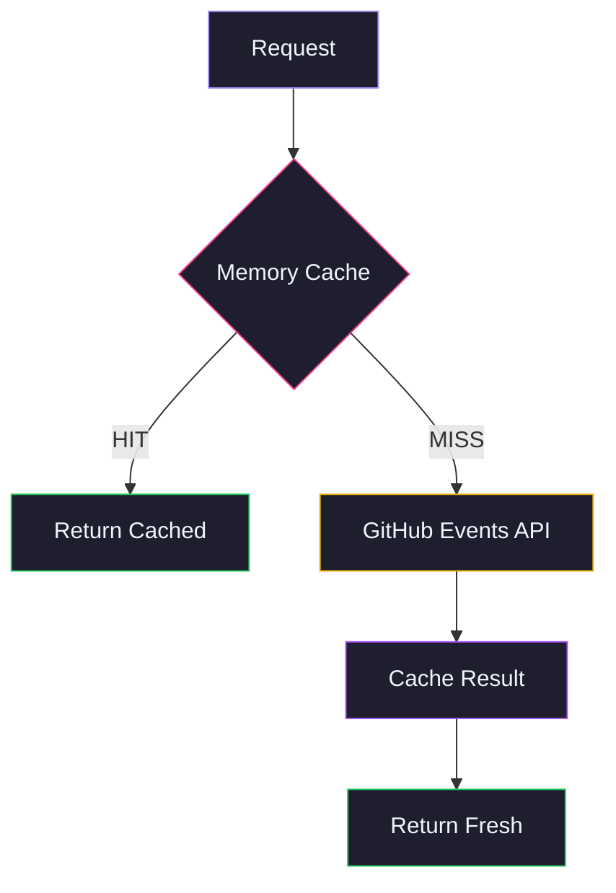

<div align="center">

  

</div>

<p align="center">
  <a href="https://github.com/Shineii86/MyLastSeen/stargazers"></a>
  <a href="https://github.com/Shineii86/MyLastSeen/network/members"></a>
  <a href="https://github.com/Shineii86/MyLastSeen/issues"></a>
  <a href="https://github.com/Shineii86/MyLastSeen/pulls"></a>
  <a href="https://github.com/Shineii86/MyLastSeen/commits"></a>
  <a href="https://github.com/Shineii86/MyLastSeen/blob/main/LICENSE"></a>
</p>

<p align="center">
  
  
  
  
  
  
</p>

<p align="center">
  <b>A serverless API that tracks when GitHub users were last active.</b><br/>
  JSON, plain text, and Shields.io badge output. Optional token for higher rate limits.<br/>
  Built for README embeds, Telegram bots, and developer dashboards.
</p>

<p align="center">
  <a href="#-table-of-contents">Table of Contents</a> &bull;
  <a href="#-features">Features</a> &bull;
  <a href="#-api-endpoints">API Docs</a> &bull;
  <a href="#-quick-start">Quick Start</a> &bull;
  <a href="#-deployment">Deployment</a> &bull;
  <a href="#-contributing">Contributing</a>
</p>

---

## 📖 Table of Contents

- [Overview](#-overview)
- [Features](#-features)
- [Supported Events](#-supported-events)
- [Tech Stack](#-tech-stack)
- [Architecture](#-architecture)
- [Project Structure](#-project-structure)
- [Quick Start](#-quick-start)
- [Configuration](#-configuration)
- [API Endpoints](#-api-endpoints)
- [API Response Schema](#-api-response-schema)
- [Shields.io Badges](#-shieldsio-badges)
- [Badge Colors](#-badge-colors)
- [Deployment](#-deployment)
- [Available Scripts](#-available-scripts)
- [Changelog Highlights](#-changelog-highlights)
- [Troubleshooting](#-troubleshooting)
- [FAQ](#-faq)
- [Roadmap](#-roadmap)
- [Contributing](#-contributing)
- [Acknowledgements](#-acknowledgements)
- [License](#-license)
- [Author](#-author)
- [Star History](#-star-history)

---

## 🌸 Overview

**MyLastSeen** is a lightweight, serverless API that tracks when GitHub users were last active by analyzing their most recent public event. No database, no auth for reads — just deploy and query.

> 💡 No database, no complex setup. Just deploy to Vercel and you have a production API.

### Why MyLastSeen?

- 👤 **User Activity** — Track when any GitHub user was last active
- 📊 **Multiple Formats** — JSON, plain text, and Shields.io badge output
- 🏷️ **Event Details** — Know what they did (push, PR, issue, release, etc.)
- ⏱️ **Relative Time** — Human-readable "2 hours ago" format
- 🎨 **Color Badges** — Activity-based colors for README embeds
- 🔑 **Optional Token** — Higher rate limits (5000/hr vs 60/hr) with a GitHub token
- ⚡ **Smart Caching** — 5-minute in-memory cache to reduce API calls
- 🔒 **CORS Enabled** — Works from any frontend, no proxy needed
- 🚀 **Zero-Config Deploy** — One click to Vercel, or run standalone with Express

### How It Works



---

## ✨ Features

<table>
  <tr>
    <td>

### ⚡ Core
- **Public events** — uses GitHub's public events API, no auth required
- **Smart caching** — 5-minute TTL, reduces API calls
- **Rate limit pass-through** — exposes GitHub's remaining quota
- **Graceful degradation** — clear errors for 404, 403, 500
- **CORS enabled** — works from any frontend

    </td>
    <td>

### 📊 Output
- **JSON** — structured data with activity type, repo, relative time
- **Plain text** — one-liner for terminal, bots, scripting
- **Shields.io badge** — endpoint badge for README embeds
- **Color-coded** — activity-based badge colors (green → red)
- **Health check** — uptime, version, cache stats

    </td>
  </tr>
  <tr>
    <td>

### 🛡️ Reliability
- **Timeout protection** — 10s per request, never hangs
- **CORS enabled** — works from any frontend
- **Security headers** — X-Frame-Options, X-Content-Type-Options
- **Rate limiting** — 100 req/min per IP with headers
- **Error handling** — structured error responses

    </td>
    <td>

### 🔑 Flexibility
- **Optional token** — pass via query param or env var
- **5000 req/hr** — with token vs 60/hr without
- **Event labels** — human-readable activity descriptions
- **Event repo** — which repo the activity was on
- **Cached flag** — know if response was from cache

    </td>
  </tr>
</table>

### 🌟 Feature Highlights

| Feature | Description | Status |
|:---|:---|:---:|
| 👤 User Last Seen | Track any public GitHub user's last activity | ✅ |
| 📊 JSON Response | Structured data with event type, repo, relative time | ✅ |
| 📝 Plain Text | One-liner output for bots and scripts | ✅ |
| 🏷️ Shields.io Badge | Endpoint badge for README embeds | ✅ |
| 🎨 Color Badges | Activity-based colors (brightgreen → red) | ✅ |
| 🔑 Optional Token | Higher rate limits with GitHub PAT | ✅ |
| ⚡ In-Memory Cache | 5-minute TTL, stats tracking | ✅ |
| 🏥 Health Check | Uptime, version, cache metrics | ✅ |
| 🔒 CORS Enabled | Works from any origin | ✅ |
| 🚀 Vercel Ready | Zero-config serverless deployment | ✅ |
| 🖥️ Express Mode | Standalone server with `npm start` | ✅ |
| 🧪 Test Suite | Integration tests for all endpoints | ✅ |

---

## 📡 Supported Events

| Event Type | Label | Description |
|:---|:---|:---|
| `PushEvent` | pushed code | Committed or pushed to a repo |
| `CreateEvent` | created a repo/branch | Created a repo, branch, or tag |
| `DeleteEvent` | deleted a branch/tag | Deleted a branch or tag |
| `IssuesEvent` | opened/closed an issue | Opened, closed, or reopened an issue |
| `IssueCommentEvent` | commented on an issue | Commented on an issue or PR |
| `PullRequestEvent` | opened/closed a PR | Opened, closed, or merged a PR |
| `PullRequestReviewEvent` | reviewed a PR | Submitted a PR review |
| `ReleaseEvent` | published a release | Published or edited a release |
| `WatchEvent` | starred a repo | Starred a repository |
| `ForkEvent` | forked a repo | Forked a repository |
| `GollumEvent` | edited a wiki | Created or edited a wiki page |
| `PublicEvent` | made a repo public | Made a private repo public |

> 💡 Events are fetched from GitHub's `/users/{username}/events/public` endpoint. Only the most recent event is used.

---

## 🛠️ Tech Stack

| Technology | Purpose | Version | Documentation |
|:---|:---|:---|:---|
| 🟢 [Node.js](https://nodejs.org/) | JavaScript runtime | >= 20 | [Docs](https://nodejs.org/docs/) |
| ⚡ [Express](https://expressjs.com/) | HTTP server framework | 5.1 | [Docs](https://expressjs.com/en/5x/api.html) |
| ▲ [Vercel Functions](https://vercel.com/docs/functions) | Serverless deployment | — | [Docs](https://vercel.com/docs/functions) |
| 🌐 [Axios](https://axios-http.com/) | HTTP client for GitHub API | 1.7 | [Docs](https://axios-http.com/docs/intro) |
| 💾 [node-cache](https://github.com/ptarjan/node-cache) | In-memory caching | 5.1 | [Docs](https://github.com/ptarjan/node-cache) |

### 📦 Key Dependencies

```json
{
  "express": "^5.1.0",
  "axios": "^1.7.2",
  "node-cache": "^5.1.2"
}
```

---

## 🏗️ Architecture

### Request Flow

| Stage | Component | Description |
|:-----:|-----------|-------------|
| 1 | **Client** | Browser, bot, or `curl` sends request |
| 2 | **Vercel Edge / Express** | Routes request, applies CORS + security headers + rate limit |
| 3 | **Cache Check** | `node-cache` with 5-min TTL — hit = instant response |
| 4 | **GitHub API** | Fetch `/users/{username}/events/public` (1 event) |
| 5 | **Extract** | Parse most recent event type, repo, timestamp |
| 6 | **Format & Respond** | Calculate relative time → JSON / Text / Badge |

### Caching Architecture



> 💡 Cache TTL is configurable via `CACHE_TTL` env var (default: 300 seconds). Cache stats are available at `/api/health`.

---

## 📁 Project Structure

```
MyLastSeen/
├── 📂 api/                            # 🌐 Vercel serverless functions
│   ├── 📄 lastseen.js                 #    👤 Last seen endpoint (JSON + text)
│   ├── 📄 badge.js                    #    🏷️ Shields.io badge endpoint
│   └── 📄 health.js                   #    💚 Health check endpoint
│
├── 📂 utils/                          # ⚙️ Core logic
│   ├── 📄 github.js                   #    📡 GitHub API client
│   ├── 📄 cacheHandler.js             #    💾 In-memory cache wrapper
│   ├── 📄 constants.js                #    📌 Shared config & defaults
│   └── 📄 relativeTime.js             #    ⏱️ Date → "2 hours ago" formatter
│
├── 📂 public/
│   └── 📄 index.html                  #    🏠 Landing page
│
├── 📄 server.js                       # 🚀 Express server entry point
├── 📄 index.js                        # ▲ Vercel serverless entry point
├── 📄 test.js                         # 🧪 Integration test suite
├── 📄 vercel.json                     # ▲ Vercel routing & headers config
├── 📄 package.json                    # 📦 Dependencies & scripts
├── 📄 CHANGELOG.md                    # 📝 Version history
├── 📄 LICENSE                         # 📜 MIT License
└── 📄 README.md                       # 📖 This file
```

---

## 🚀 Quick Start

### Prerequisites

| Requirement | Minimum | Recommended |
|:---|:---|:---|
| 📦 Node.js | 20.x | 20.x LTS |
| 📦 npm | 9.0+ | 10.x |
| 💻 OS | Windows, macOS, Linux | Any |

### 🔧 Installation

```bash
# 1️⃣ Clone the repository
git clone https://github.com/Shineii86/MyLastSeen.git
cd MyLastSeen

# 2️⃣ Install dependencies
npm install

# 3️⃣ Start development server
npm run dev
```

> 🌐 Open [http://localhost:3000](http://localhost:3000) in your browser.

### 🏗️ Build for Production

```bash
# Start production server
npm start

# Run tests
npm test
```

### 🐳 Alternative Package Managers

```bash
# Using yarn
yarn install
yarn dev

# Using pnpm
pnpm install
pnpm dev
```

---

## ⚙️ Configuration

| Environment Variable | Default | Description |
|:---|:---|:---|
| `PORT` | `3000` | Server port (local dev) |
| `GITHUB_TOKEN` | — | GitHub PAT for higher rate limits |
| `CACHE_TTL` | `300` | Cache TTL in seconds |

### Rate Limits

| Mode | Limit | Setup |
|:---|:---|:---|
| Without token | 60 req/hr | None — works out of the box |
| With token | 5000 req/hr | Set `GITHUB_TOKEN` env or pass `?token=` query param |

### 🔑 Getting a GitHub Token

1. Go to [GitHub Settings → Developer Settings → Personal Access Tokens](https://github.com/settings/tokens)
2. Click **Generate new token (classic)**
3. No scopes needed — public events don't require any permissions
4. Copy the token and set it as `GITHUB_TOKEN` env var

---

## 📡 API Endpoints

### `GET /api/lastseen/:username`

Returns last-seen data as JSON.

```bash
curl https://mylastseen.vercel.app/api/lastseen/Shineii86
```

```json
{
  "success": true,
  "data": {
    "username": "Shineii86",
    "lastSeen": "2026-05-28T12:00:00Z",
    "relativeTime": "2 hours ago",
    "eventType": "PushEvent",
    "eventLabel": "pushed code",
    "eventRepo": "Shineii86/AniNewsAPI",
    "cached": false
  },
  "meta": {
    "responseTime": "120ms",
    "timestamp": "2026-05-28T14:00:00Z"
  }
}
```

### `GET /api/lastseen/:username/text`

Returns last-seen as plain text.

```bash
curl https://mylastseen.vercel.app/api/lastseen/Shineii86/text
```

```
Shineii86 — Last seen: 2 hours ago (pushed code)
```

### `GET /api/lastseen/:username/badge`

Returns Shields.io endpoint badge JSON.

```bash
curl https://mylastseen.vercel.app/api/lastseen/Shineii86/badge
```

```json
{
  "schemaVersion": 1,
  "label": "last seen",
  "message": "2 hours ago",
  "color": "green",
  "namedLogo": "github",
  "cacheSeconds": 300
}
```

### `GET /api/health`

Returns API health status, version, and cache stats.

```bash
curl https://mylastseen.vercel.app/api/health
```

```json
{
  "success": true,
  "status": "healthy",
  "name": "MyLastSeen",
  "version": "1.0.0",
  "uptime": 3600,
  "cache": { "hits": 42, "misses": 10, "keys": ["Shineii86"], "ttl": 300 }
}
```

---

## 📋 API Response Schema

### Last Seen Response

| Field | Type | Description |
|:---|:---|:---|
| `success` | `boolean` | Always `true` on success |
| `data.username` | `string` | GitHub username |
| `data.lastSeen` | `string` | ISO 8601 timestamp of last activity |
| `data.relativeTime` | `string` | Human-readable time (e.g., "2 hours ago") |
| `data.eventType` | `string` | GitHub event type (e.g., `PushEvent`) |
| `data.eventLabel` | `string` | Human-readable label (e.g., "pushed code") |
| `data.eventRepo` | `string` | Repository the activity was on |
| `data.cached` | `boolean` | Whether response was served from cache |
| `meta.responseTime` | `string` | Server response time |
| `meta.timestamp` | `string` | Server timestamp |

---

## 🏷️ Shields.io Badges

Add a last-seen badge to your README:

```markdown

```


### Custom Style

```markdown
<!-- Flat style -->


<!-- For-the-badge style -->


<!-- With logo override -->

```

---

## 🎨 Badge Colors

| Activity | Timeframe | Color |
|:---|:---|:---|
| Very recent | < 1 hour |  |
| Active | < 6 hours |  |
| Today | < 24 hours |  |
| Recent | < 3 days |  |
| This week | < 7 days |  |
| Inactive | > 7 days |  |

---

## 🚀 Deployment

### Vercel (Recommended)

1. Fork or import [Shineii86/MyLastSeen](https://github.com/Shineii86/MyLastSeen)
2. Connect to [Vercel](https://vercel.com)
3. Deploy — zero configuration needed
4. (Optional) Set `GITHUB_TOKEN` env var for higher rate limits

### One-Click Deploy

[](https://vercel.com/new/clone?repository-url=https://github.com/Shineii86/MyLastSeen)

### Self-Hosting

```bash
git clone https://github.com/Shineii86/MyLastSeen.git
cd MyLastSeen
npm install
GITHUB_TOKEN=ghp_xxxxx npm start
```

---

## 📜 Available Scripts

| Script | Command | Description |
|:---|:---|:---|
| `npm run dev` | `node server.js` | Start local dev server |
| `npm start` | `NODE_ENV=production node server.js` | Start production server |
| `npm test` | `node test.js` | Run integration tests |
| `npm run build` | `echo 'Build complete'` | No-op build for Vercel |

---

## 📰 Changelog Highlights

| Version | Date | Highlights |
|:---|:---|:---|
| **1.0.0** | 2026-05-28 | Initial release — JSON, text, badge, health endpoints, Vercel support |

See [CHANGELOG.md](CHANGELOG.md) for full history.

---

## ❓ Troubleshooting

<details>
<summary><b>Rate limit exceeded (403)</b></summary>

Without a token, GitHub allows 60 requests/hour. Set `GITHUB_TOKEN` for 5000/hr.

```bash
curl -H "Authorization: Bearer ghp_xxxxx" https://api.github.com/users/Shineii86/events/public
```
</details>

<details>
<summary><b>User not found (404)</b></summary>

The user must have **public events** enabled. Private profiles or users with no activity will return 404.
</details>

<details>
<summary><b>No activity found</b></summary>

Some users may not have recent public events. The API returns a clear message when no activity is found.
</details>

---

## ❓ FAQ

**Q: Does this work for private profiles?**
A: No. Only users with public activity can be tracked.

**Q: How accurate is the "last seen" time?**
A: It reflects the timestamp of the user's most recent public event on GitHub.

**Q: Can I use this in a Telegram bot?**
A: Yes! Use the `/text` endpoint for plain text output perfect for bots.

**Q: Is there a rate limit?**
A: 60 req/hr without a token, 5000 req/hr with one. Cached responses don't count.

---

## 🗺️ Roadmap

- [ ] User contribution graph data
- [ ] Multiple user batch lookup
- [ ] Webhook notifications for user activity
- [ ] Activity streak tracking
- [ ] GraphQL API support

---

## 🤝 Contributing

Contributions are welcome! Please read the steps below.

1. Fork the repository
2. Create a feature branch (`git checkout -b feature/amazing-feature`)
3. Commit your changes (`git commit -m 'Add amazing feature'`)
4. Push to the branch (`git push origin feature/amazing-feature`)
5. Open a Pull Request

Please ensure all tests pass before submitting.

---

## 🙏 Acknowledgements

- [GitHub API](https://docs.github.com/en/rest/activity/events) — Public events endpoint
- [Shields.io](https://shields.io/) — Badge rendering service
- [Vercel](https://vercel.com/) — Serverless deployment platform

---

## 📄 License

<div align="center">

[](./LICENSE)

This project is licensed under the **MIT License**.

Free to use, modify, and distribute — see the [LICENSE](LICENSE) file for details.

</div>

---

## 👤 Author

<div align="center">

  <a href="https://github.com/Shineii86/MyLastSeen">
  
  </a>

</div>

<p align="center">
  <b style="font-size: 5.5em;">Shinei Nouzen</b>
  <br/>
  <sub>Full-Stack Developer & Anime Enthusiast</sub>
  <br/><br/>
  <a href="https://github.com/Shineii86"></a>
  <a href="https://telegram.me/Shineii86"></a>
  <a href="https://instagram.com/ikx7.a"></a>
  <a href="mailto:ikx7a@hotmail.com"></a>
</p>

---

## ⭐ Star History

<p align="center">
  <a href="https://star-history.com/#Shineii86/MyLastSeen&Date">
    
  </a>
</p>

> ⭐ If you found this project useful, please consider giving it a star!

---

<p align="center">
  <b>Made With ❤️ For The Developer Community</b>
  <br/><br/>
  <sub>&copy; 2026 Shineii86. All Rights Reserved.</sub>
</p>
